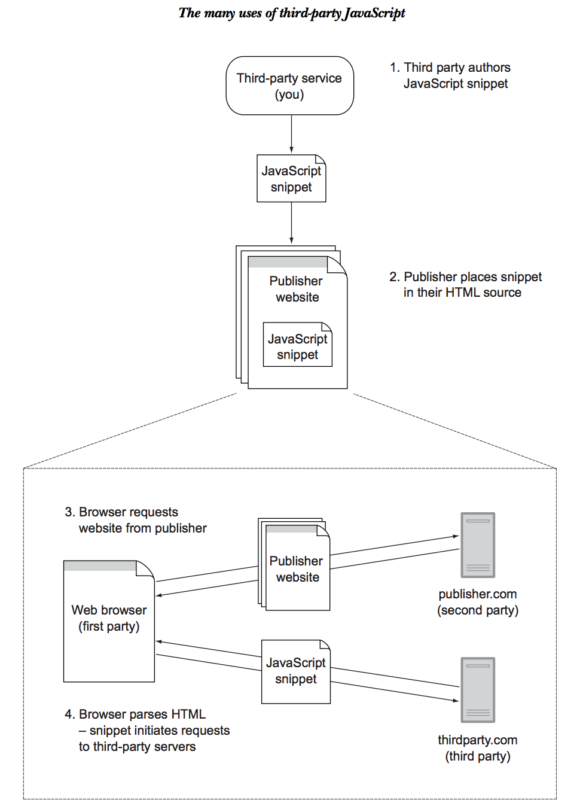

##Why are these dudes talking to us?
We want to tell you about third party javascript and our new app: ***Tinder for Vegans***. 
###First thing's first, what is third party JS? 
**It is a script that allows people to embed content / functionality into their own websites and blogs by copy-pasting a little bit of code.**

###Well I guess that makes sense if you're a robot, but can you give us an example...?
Sure, we see these things out in the wild everyday.
 
* Advertisements
* Facebook like buttons
* Analytics
* Disqus commenting
* Gravatars

### So wait, why is this important to me?
As *developers* we have the ability to both use and distribute third-party scripts. For the former, we can leverage code written by others such as a YouTube video player because there is no way in hell we're rolling our own one of those. As for the latter, we can author scripts that we intend to put on a content provider's website. That's where things get more interesting. 

##How do these things work?
Good question, we asked google the same thing. Here is a diagram we found on the internets -

## Three Main Types
### 1. Embedded Scripts
These are probably the most common and the type we'll be demoing today. Typically, these are small apps that are rendered and made accessible on a publisher's website, but load and submit resources from a separate set of servers. It may seem simple, but *entire businesses* are built surrounding this concept. 
 
These scripts can either only be valuable in their distributed form (Disqus) -or- they can be portable extensions of a larger core product (Google Maps).
### 2. Analytics and Metrics
These are the mixpanels and Google analytics of the world, sitting silently in the DOM collecting information about us as we traverse the interwebs. Creepy. Awesome. And creepy.

##### Passive Scripts
These scripts require no input from the publisher beyond including the snippet in the DOM. From here, all of the data is collected automatically. Example - *Crazyegg*.  
##### Active Scripts
Active scripts require some user inputs in order to work. A good example is MixPanel. Say I'd like to track how many people click a new button I've added to my page. Well, as the dev, I need to tell MixPanel to 'track this button' and log an event everytime it happens. 

### 3. Web Service API Wrappers
These scripts simplify client-side access to an API. A good example here is the FB Graph API. Facebook has a JS library that provides functions for you to communicate with their API. 
